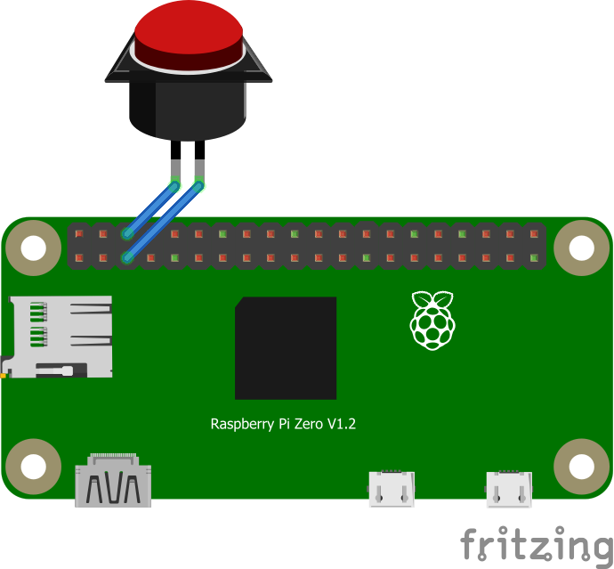

# Raspberry Pi Button Shutdwon 



## Usage

To install the shutdown daemon with the configuration shown in the sketch
above use the latest release and execute the following command.

```
sudo ./shutdown -I
```

The Rraspberry Pi will now shutdown immediately if the button connected
to pin number 5 is pressed longer than ~3sec. To customize time and pin
have a look at the development section below.

## Development

### Compilation

```
wget http://www.airspayce.com/mikem/bcm2835/bcm2835-1.68.tar.gz
cd bcm2835-1.68
./configure
make
sudo make check
sudo make install
cd ..
git clone https://github.com/urbans0ft/raspberry-shutdown-button.git
cd raspberry-shutdown-button
make release
```

### Customization

```
make clean
make PIN_NO=Pin05 SAFETY_DELAY=3000ms POLL_DELAY=500ms
```
